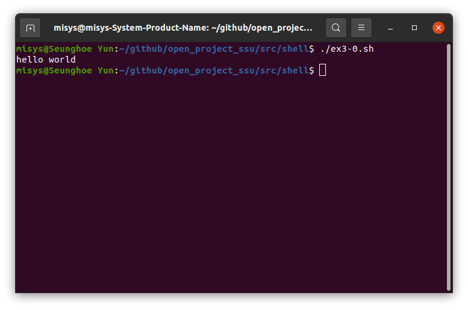

**
🎊repositories 방문을 환영합니다..!🎊
**
======
**
 과목 : 오픈소스기초설계  
**
**
 교수 : 김성흠  
**
**
 이름 : [윤승회](https://github.com/YunSeungHoe) 
**
**
 이메일 : dbstmdghl@naver.com 
**

**
 📚Studying📚      🛠Tools🛠     
**
 

------

**
 개별 프로젝트
**
======
+ __메토어__
  - 메토어는 메타버스 + 스토어의 합성어이다.
  - 메토어는 가상현실, 증강현실을 통해서 옷을 구매할 수 있는 시장이다.
  - 언제, 어디서든, 누구나 VR기기, 스마트미러, 스마트폰을 가지고 있으면 쉽고 재미있게 본인에게 어울리는 옷을 구매할 수 있다.
  - 메토어 프로젝트는 앞으로 오프라인 옷 매장이 모두 사라지는 것을 목표로 한다.

------
**
shell programming
**
======

- ex3-0.sh

 

- ex3-1.sh

 

- ex3-2.sh

 

- ex3-3.sh

 

- ex3-4.sh

 

- ex3-5.sh

 

- ex3-6.sh

 

- ex3-7.sh

 

- ex3-8.sh

 

- ex3-9.sh

 

-------